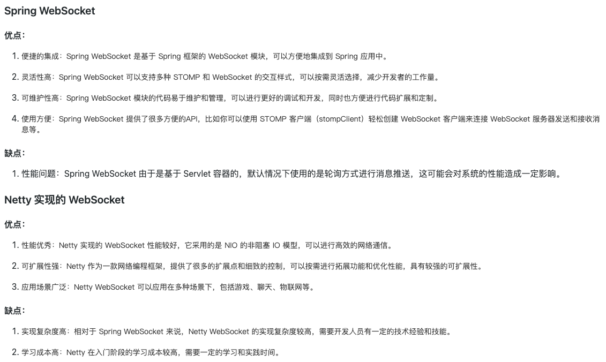

# netty-websocket-spring-boot 
基于Netty实现了大部分spring-websocket的功能，



```java
<dependency>
    <groupId>com.niezhiliang</groupId>
    <artifactId>netty-websocket-spring-boot-starter</artifactId>
    <version>0.0.1-SNAPSHOT</version>
</dependency>
```

```java
@WsServerEndpoint(value = "/websocket/{uid}/{arg}")
public class ServerEndpoint {

    @HandshakeBefore
    public void before (HttpHeaders headers) {
        System.out.println("before");
    }

    /**
     * 用户连接时触发
     * @param session
     */
    @OnOpen
    public void open(Session session, @PathParam (value="uid") String uid, @PathParam String arg){
        System.out.println("open");
        session.sendText("hello client");
    }

    /**
     * 收到信息时触发
     * @param message
     */
    @OnMessage
    public void onMessage(Session session,String message){
        System.out.println("message:" + message);
        session.sendText("server: " + message);
    }

    /**
     * 连接关闭触发
     */
    @OnClose
    public void onClose(){
        System.out.println("close  " + LocalDateTime.now());
    }

    /**
     * 发生错误时触发
     * @param session
     * @param e
     */
    @OnError
    public void onError(Session session, Throwable e) {
        System.out.println("onError");
    }

    /**
     * 发生事件时触发
     * @param session
     * @param evt
     */
    @OnEvent
    public void onEvent(Session session, Object evt) {
        if (evt instanceof IdleStateEvent) {
            // 心跳事件处理
        }
    }
}
```

## 开发目的

之前该项目是基于`spring-boot-starter-websocket`做的一个Demo，start还不错，
偶然间看到大佬基于Netty实现了 一个轻量级高性能的websocket框架，
而且用法和`spring-boot-starter-websocket`一样，完全注解驱动，看到后感触很大，
觉得他很牛逼，看了下他的源码，大致原理和技术知道了以后，觉得我之前也看过那么多的spring
源码，觉得我也能写出来，于是就强迫自己写了该项目。


